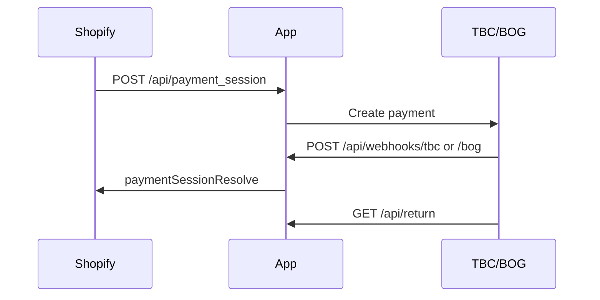

# LariPay.ai + Georgia Pay (Shopify)

Next.js 14 app: **LariPay.ai** (laripay.ai) payment platform API and **Shopify** offsite payments (TBC Pay + BOG Pay, GEL).

## Stack

- Next.js 14 (App Router)
- Prisma + SQLite
- Georgian Payments SDK (`../../../src/georgian-payments.cjs`)
- Shopify Payments App API (optional)

## Setup

```bash
cp .env.example .env
npm install
npx prisma db push
npm run dev
```

From repo root: `npm start` (Next + ngrok + env sync).

Configure bank credentials in `.env`. Open `/api/laripay/setup` for demo API key.

## LariPay.ai (platform API)

| Route | Purpose |
|-------|---------|
| `POST /api/v1/checkout/sessions` | Create checkout (Bearer `sk_test_...`) |
| `GET /api/v1/checkout/sessions/:id` | Session status |
| `GET /api/v1/payments/:id` | Payment + 1% fee breakdown |
| `GET /api/v1/balance` | Volume & fees |
| `GET /api/laripay/setup` | Bootstrap demo merchant |
| `GET /laripay/dashboard` | Admin stats |

See [LARIPAY-API.md](../../../LARIPAY-API.md).

**Billing:** 1% per payment (`COMMISSION`) or subscription (`starter` / `pro`) with 0% fee while active.

## Shopify flow



| Route | Purpose |
|-------|---------|
| `POST /api/payment_session` | Shopify checkout redirect |
| `POST /api/refund_session` | Refund |
| `GET /api/return` | Shopify customer return |
| `POST /api/webhooks/tbc` | TBC IPN (Shopify) |
| `POST /api/webhooks/bog` | BOG IPN (Shopify) |
| `GET/PUT /api/settings` | Per-shop bank credentials |

## Unified bank URLs (LariPay.ai + demo)

Register at the bank:

- **Return:** `LARIPAY_RETURN_URL` → `/payment/return`
- **Webhook:** `LARIPAY_WEBHOOK_URL` → `/api/webhook` (auto-detects TBC vs BOG)

## Database

```bash
npx prisma studio
```

Models: `Shop`, `ShopSettings`, `PaymentRecord`, `RefundRecord`, `Merchant`, `CheckoutSession`, `PaykaPayment`, …

## Shopify CLI

```bash
npx shopify auth login
npm run shopify:link
npm run shopify:dev
```

Requires Payments Partner approval for production and store currency **GEL**.
