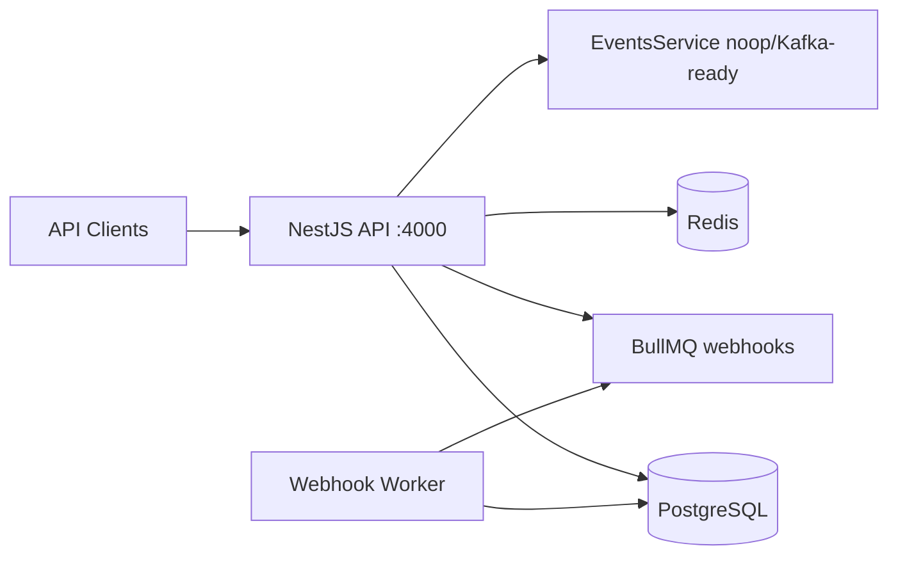

# LariPay Core

NestJS payment platform API: merchants, payment intents, ledger, webhooks (BullMQ), payouts, subscriptions, fraud scoring, and admin tools.

## Architecture



| Module | Responsibility |
|--------|----------------|
| `auth` | JWT register/login/refresh, bcrypt passwords |
| `merchants` | Onboarding, API keys (`sk_test_` / `sk_live_`) |
| `checkout` | Orders, redirect hosted pages, embedded sessions, direct/3DS flow |
| `payments` | Intents, authorize/capture/refund, checkout sessions, mock provider |
| `open-banking` | OPB sessions, bank list (TBC/BOG/Liberty/Credo), SCA mock |
| `wallets` | Merchant balance & ledger entries API |
| `customers` | Customer CRUD for merchant backends |
| `tokens` | PCI-safe card tokenization (no raw PAN storage) |
| `qr` | QR payment codes |
| `ledger` | Double-entry `LedgerEntry`, merchant balances |
| `webhooks` | Endpoint registration, signed delivery, retries |
| `payouts` | Merchant payout requests |
| `subscriptions` | Plans CRUD, merchant subscriptions |
| `fraud` | IP/velocity scoring |
| `admin` | Merchant approval, payments, audit logs |
| `events` | `logEvent()` with pluggable transport (noop default) |

## Quick start

```bash
cp .env.example .env
docker compose up -d postgres redis
npx prisma migrate dev
npm run start:dev
```

- API: `http://localhost:4000/api`
- Swagger: `http://localhost:4000/docs`
- Health: `http://localhost:4000/api/health`

## Auth

- **Dashboard JWT**: `POST /api/auth/login` → `Authorization: Bearer <accessToken>`
- **Server API key**: `Authorization: Bearer sk_test_...` on payment/payout/webhook routes

## Workers

```bash
RUN_WORKERS=1 npm run start:dev
# or
docker compose --profile worker up worker
```

## Shopify / Next.js proxy

Set `LARIPAY_CORE_API_URL=http://localhost:4000` in the Georgia Pay app to forward API calls via `/api/laripay/core/*`.

## Enterprise checkout modes

| Mode | Endpoint | Description |
|------|----------|-------------|
| Redirect | `POST /api/v1/checkout/redirect` | Returns `checkout_url` → hosted HTML page on Core |
| Embedded | `POST /api/v1/checkout/embedded` | Returns `session_token` + SDK URLs (`/sdk/checkout.js`) |
| Direct | `POST /api/v1/checkout/direct` | Server-to-server with optional 3DS redirect |

Embedded SDK callbacks: `onPaymentSuccess`, `onPaymentFailed`, `onValidationError`, `onSubmit`, `on3DSRedirect`.

## Webhook retries

Delivery retries: **2s → 60s → 5m → 10m → 1h → 24h** (6 attempts). Events include `payment.succeeded`, `payment.failed`, `refund.created`, `payout.completed`, `subscription.renewed`, `dispute.created`.

## Signature auth

- Webhooks: HMAC-SHA256 (`X-LariPay-Signature`, `X-LariPay-Timestamp`)
- Merchant API: Bearer `sk_test_` / `sk_live_` or legacy headers
- Optional SHA1 param signing via `SignatureService.signParamsSha1` for partner gateways
